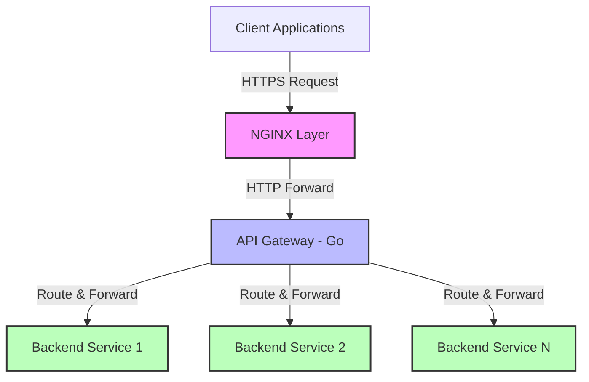
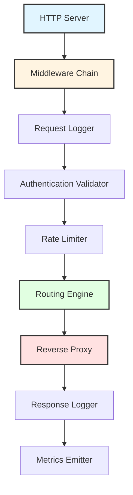
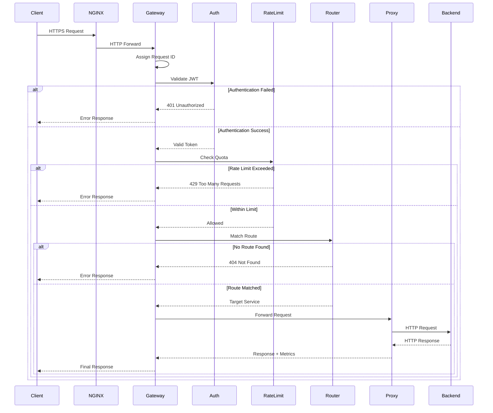
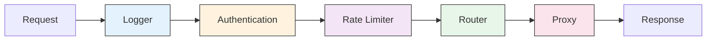

# API Gateway

**Status:** In Active Development  
**Type:** Backend Infrastructure / Platform Component  
**Language:** Go  
**Infrastructure:** NGINX + AWS

## Table of Contents

- [Overview](#overview)
- [Design Principles](#design-principles)
- [Architecture](#architecture)
- [System Components](#system-components)
- [Request Flow](#request-flow)
- [Routing Mechanism](#routing-mechanism)
- [Middleware Pipeline](#middleware-pipeline)
- [Reverse Proxy Layer](#reverse-proxy-layer)
- [Error Handling](#error-handling)
- [Configuration](#configuration)
- [Project Structure](#project-structure)
- [Development Approach](#development-approach)
- [Future Roadmap](#future-roadmap)

## Overview

This project implements a production-grade API Gateway that serves as the single entry point for distributed backend services. The gateway enforces cross-cutting concerns including request routing, authentication, rate limiting, and observability while maintaining strict separation from business logic.

The system is designed from first principles to address fundamental challenges in distributed service architectures: consistent policy enforcement, traffic control, service isolation, and centralized observability.

## Design Principles

The gateway architecture adheres to the following core principles:

**Separation of Concerns**  
Each component has a single, well-defined responsibility. Infrastructure concerns remain isolated from business logic.

**Deterministic Behavior**  
Request handling follows predictable paths with explicit failure modes. No hidden state or implicit behavior.

**Fail-Fast Philosophy**  
Invalid configurations prevent startup. Runtime errors are explicit and never silently ignored.

**Configuration as Data**  
Routing rules and policies are declarative, not embedded in code. Services evolve independently of gateway logic.

**Observability by Default**  
All traffic is logged and measurable. System behavior is transparent and debuggable.

## Architecture

### High-Level Architecture



### Responsibility Distribution

| Layer | Primary Responsibilities |
|-------|-------------------------|
| NGINX | TLS termination, connection pooling, request buffering, static content serving |
| API Gateway | Policy enforcement, routing decisions, authentication validation, rate limiting, observability |
| Backend Services | Business logic, data processing, domain-specific operations |

This layered approach mirrors production systems where network-level concerns are separated from application-level policy enforcement.

## System Components

### Internal Gateway Architecture



**HTTP Server**  
Manages TCP connections, HTTP protocol handling, and graceful shutdown semantics.

**Middleware Chain**  
Sequential processing pipeline for cross-cutting concerns. Order is architecturally significant.

**Routing Engine**  
Maps incoming request paths to upstream service targets using longest-prefix matching.

**Reverse Proxy**  
Transparent request forwarding with timeout enforcement and connection management.

**Observability Layer**  
Structured logging, request tracing, and metric emission for operational visibility.

## Request Flow

### Complete Request Lifecycle



### Flow Characteristics

**At-Most-Once Delivery**  
Requests are forwarded exactly once. No automatic retries at the gateway level.

**Short-Circuit Evaluation**  
Failed validation steps immediately terminate the request pipeline.

**Transparent Proxying**  
Request and response bodies pass through unchanged. No payload inspection or modification.

**Timeout Enforcement**  
Hard timeouts prevent unbounded upstream latency from blocking gateway resources.

## Routing Mechanism

### Route Matching Algorithm

The router uses longest-prefix matching to select upstream targets:

1. Extract request path from incoming HTTP request
2. Sort configured routes by prefix length (descending)
3. Return first route where request path starts with route prefix
4. If no match found, return 404 Not Found

### Example Route Configuration

```yaml
routes:
  - prefix: "/webhooks/"
    target: "http://webhook-service:8080"
    auth_required: true
    
  - prefix: "/users/"
    target: "http://user-service:8080"
    auth_required: true
    
  - prefix: "/public/"
    target: "http://public-service:8080"
    auth_required: false
    
  - prefix: "/"
    target: "http://default-service:8080"
    auth_required: false
```

### Routing Properties

**Deterministic**: Same input always produces same output  
**Stateless**: No routing state maintained between requests  
**Config-Driven**: Routes defined declaratively, not in code  
**Predictable**: Most-specific route always wins

## Middleware Pipeline

### Execution Order



### Middleware Responsibilities

**Request Logger**  
- Assigns unique request ID
- Logs request metadata (method, path, headers)
- Always executes, never blocks
- Captures timing information

**Authentication Validator**  
- Validates JWT tokens when required
- Extracts identity claims
- Does not issue or refresh tokens
- Fails fast on invalid credentials

**Rate Limiter**  
- Enforces request quotas per identity
- Protects backend services from traffic spikes
- Returns 429 when limits exceeded
- Applied after authentication

### Middleware Constraints

Middleware components must not:
- Perform routing decisions
- Call backend services
- Modify request or response bodies
- Maintain long-lived state

## Reverse Proxy Layer

### Proxy Guarantees

**Single Forward Attempt**  
Each request is forwarded to upstream exactly once. No retries.

**Transparent Pass-Through**  
Request and response bodies are not inspected, parsed, or modified.

**Timeout Enforcement**  
All upstream calls have hard timeouts to prevent resource exhaustion.

**Connection Management**  
Proper connection pooling and cleanup to avoid resource leaks.

### Proxy Non-Guarantees

The proxy explicitly does not provide:
- Automatic retries on failure
- Delivery guarantees
- Request idempotency enforcement
- Circuit breaking

These concerns belong in clients or asynchronous delivery systems.

## Error Handling

### HTTP Status Code Semantics

| Scenario | Status Code | Meaning |
|----------|-------------|---------|
| Route not found | 404 | No matching route in configuration |
| Missing authentication | 401 | Required JWT token not provided |
| Invalid authentication | 403 | JWT token invalid or expired |
| Rate limit exceeded | 429 | Client has exceeded request quota |
| Upstream timeout | 502 | Backend service did not respond in time |
| Upstream error | 502 | Backend service returned error |
| Gateway internal error | 500 | Unexpected gateway failure |

### Failure Philosophy

**Explicit Over Implicit**  
All failure modes return clear HTTP status codes with descriptive error messages.

**No Error Amplification**  
Gateway does not retry failed requests, preventing cascade failures.

**Fail-Fast**  
Invalid requests are rejected as early as possible in the pipeline.

## Configuration

### Configuration Strategy

**Validation at Startup**  
All configuration is validated before the server starts accepting traffic. Invalid configuration prevents startup.

**Declarative Specification**  
Routes, policies, and settings are defined in structured configuration files, not code.

**No Dynamic Reloads**  
Configuration changes require service restart. This ensures consistency and predictability.

### Configuration Structure

```yaml
server:
  port: 8080
  timeout: 30s
  
authentication:
  jwt_secret: "${JWT_SECRET}"
  required_by_default: true
  
rate_limiting:
  default_requests_per_minute: 60
  burst_size: 10
  
routes:
  - prefix: "/api/"
    target: "http://backend:8080"
    auth_required: true
    rate_limit: 100
```

## Project Structure

```
api-gateway/
├── cmd/
│   └── gateway/
│       └── main.go              # Application entry point
├── internal/
│   ├── config/
│   │   ├── config.go            # Configuration types
│   │   └── validator.go         # Config validation
│   ├── server/
│   │   └── server.go            # HTTP server setup
│   ├── middleware/
│   │   ├── logger.go            # Request logging
│   │   ├── auth.go              # JWT authentication
│   │   └── ratelimit.go         # Rate limiting
│   ├── router/
│   │   ├── router.go            # Routing engine
│   │   └── matcher.go           # Route matching logic
│   ├── proxy/
│   │   └── proxy.go             # Reverse proxy implementation
│   └── observability/
│       ├── logger.go            # Structured logging
│       └── metrics.go           # Metrics emission
├── configs/
│   ├── gateway.yaml             # Default configuration
│   └── gateway.example.yaml    # Example configuration
├── deployments/
│   ├── nginx.conf               # NGINX configuration
│   └── docker-compose.yaml     # Local development setup
├── go.mod
├── go.sum
└── README.md
```

### Package Boundaries

Each package has a single architectural purpose:

**cmd/gateway**: Application bootstrap and dependency injection  
**internal/config**: Configuration loading and validation  
**internal/server**: HTTP server lifecycle management  
**internal/middleware**: Cross-cutting concern implementations  
**internal/router**: Request routing logic  
**internal/proxy**: Upstream communication  
**internal/observability**: Logging and metrics infrastructure

## Development Approach

### Implementation Strategy

**Design-First Development**  
System design is finalized before implementation begins. This prevents architectural drift and reduces rewrites.

**Module-by-Module Implementation**  
Components are built incrementally in dependency order. Each module is complete before moving to the next.

**Production Mindset**  
Code is written with production deployment in mind from the start. No prototype-to-production transitions.

### Testing Strategy

**Unit Tests**  
Each package has isolated unit tests with mocked dependencies.

**Integration Tests**  
End-to-end request flows are tested with real HTTP servers.

**Configuration Tests**  
Invalid configurations are tested to ensure proper validation.

## Future Roadmap

This gateway serves as the foundation for a broader platform architecture. Planned extensions include:

**Webhook Delivery System**  
Reliable, at-least-once delivery of webhook events to external systems.

**Background Job Queue**  
Asynchronous task processing with retry logic and dead-letter handling.

**Workflow Orchestration**  
Multi-step process coordination across distributed services.

The gateway itself remains stable as these systems are built behind it. The architectural boundary ensures platform evolution does not require gateway changes.

---

## License

This project is developed for educational and portfolio purposes.

## Contact

For questions or feedback about this project's architecture and design decisions, please open an issue in the repository.
